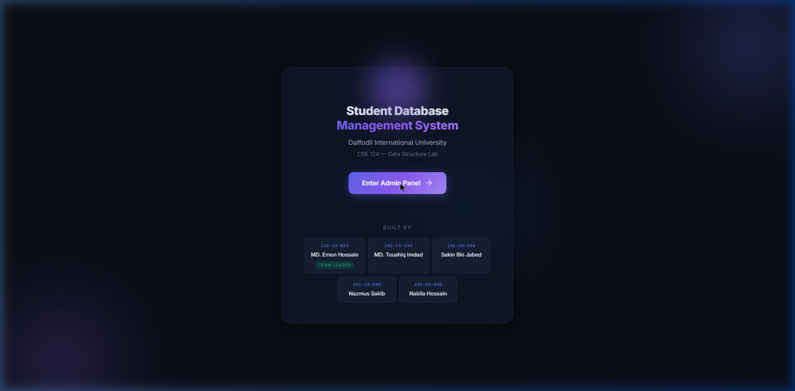
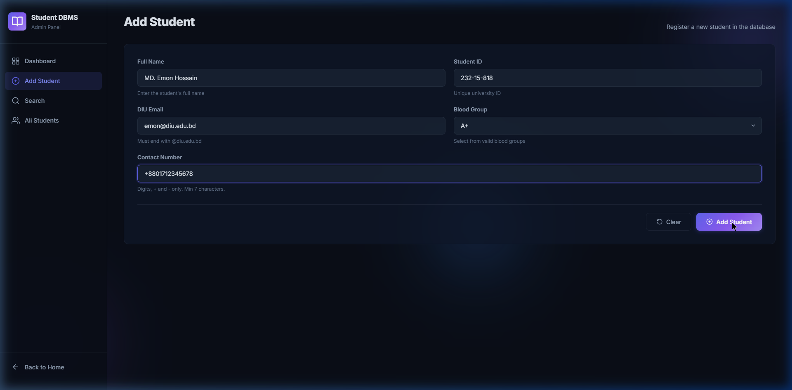
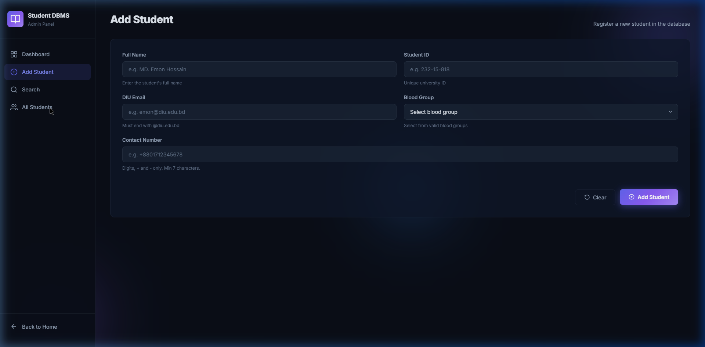
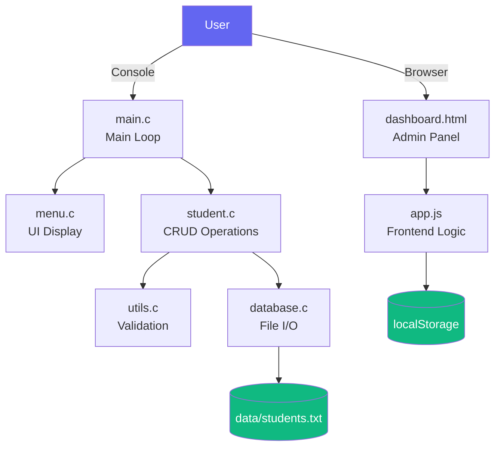

<p align="center">
  
</p>

<h1 align="center">Student Database Management System</h1>

<p align="center">
  <strong>A Console + Web Admin Panel for Managing University Student Records</strong>
</p>

<p align="center">
  
  
  
  
  
</p>

<p align="center">
  
  
</p>

---

## 📸 Screenshots

<p align="center">
  
  <br>
  <em>Landing Page — Modern dark theme with glassmorphism</em>
</p>

<p align="center">
  
  <br>
  <em>Add Student — Form with full input validation</em>
</p>

<p align="center">
  
  <br>
  <em>Student Records — Data table with edit/delete actions</em>
</p>

---

## 📌 Project Overview

This project is a **Student Database Management System** developed as part of the **CSE 124: Data Structure Lab** course at Daffodil International University. It demonstrates practical implementation of **Singly Linked List** data structure for managing student records with full **CRUD** (Create, Read, Update, Delete) operations.

The system consists of two components:

| Component | Technology | Description |
|-----------|-----------|-------------|
| **Console Backend** | C Programming | Core linked list operations with file persistence |
| **Web Admin Panel** | HTML / CSS / JS | Modern dashboard UI with localStorage-based CRUD |

---

## ✨ Features

### 🖥️ Console Backend (C)
- ✅ **Add** student records with duplicate validation (ID, Email, Phone)
- ✅ **Delete** student by ID with confirmation
- ✅ **Update** any student field — press Enter to skip unchanged fields
- ✅ **Search** student by university ID
- ✅ **Display** all records in formatted tables
- ✅ **Count** total students in the database
- ✅ **Persistent storage** via CSV text file (`data/students.txt`)
- ✅ **Input validation** — email domain check (`@diu.edu.bd`), blood group whitelist, contact format
- ✅ **Memory management** — proper `malloc`/`free` lifecycle

### 🌐 Web Admin Panel (Frontend)
- ✅ Modern **dark theme** with glassmorphism and animated gradients
- ✅ Full **CRUD operations** with localStorage persistence
- ✅ **Dashboard** with real-time statistics (total students, blood groups, etc.)
- ✅ **Search** by student ID with instant results
- ✅ **Filter** records across all fields in real-time
- ✅ **Edit/Delete modals** with confirmation dialogues
- ✅ **Toast notifications** for all user actions
- ✅ **Responsive design** — works on desktop and mobile
- ✅ **XSS prevention** — all user input is HTML-escaped

---

## 🛠️ Technologies & Concepts Used

| Category | Technologies |
|----------|-------------|
| **Language** | C (C99 standard) |
| **Data Structure** | Singly Linked List |
| **File I/O** | CSV read/write with `fscanf`/`fprintf` |
| **Frontend** | HTML5, CSS3, Vanilla JavaScript |
| **Design** | CSS Custom Properties, Glassmorphism, CSS Grid & Flexbox |
| **Typography** | Google Fonts (Inter) |
| **Storage** | File-based (backend) + localStorage (frontend) |
| **Build** | GCC compiler + Makefile |

---

## 📂 Project Structure

```
Student-Database-Management-System/
│
├── src/                          # C source files
│   ├── main.c                    # Entry point — main loop
│   ├── student.c                 # CRUD operations (add, delete, update, search)
│   ├── database.c                # File I/O — save & load from students.txt
│   └── utils.c                   # Validation helpers & safe input
│
├── include/                      # Header files
│   ├── student.h                 # Student struct & CRUD prototypes
│   ├── database.h                # File I/O prototypes
│   ├── utils.h                   # Validation function prototypes
│   └── menu.h                    # Console menu prototypes
│
├── ui/                           # Console UI module
│   └── menu.c                    # Welcome screen & main menu display
│
├── data/                         # Runtime data
│   └── students.txt              # Persistent student records (CSV)
│
├── frontend/                     # Web Admin Panel
│   ├── index.html                # Landing page
│   ├── dashboard.html            # Admin dashboard
│   ├── css/
│   │   └── style.css             # Premium dark theme stylesheet
│   ├── js/
│   │   └── app.js                # CRUD logic with localStorage
│   └── assets/
│       └── diu-logo.png          # University logo
│
├── tests/                        # Test documentation
│   └── test_cases.txt            # 20 functional test cases
│
├── docs/                         # Documentation
│   └── report.pdf                # Project report
│
├── assets/                       # Project assets
│   └── screenshots/              # README screenshots
│
├── Makefile                      # Build automation
├── README.md                     # This file
├── LICENSE                       # MIT License
└── .gitignore                    # Git ignore rules
```

---

## 🏗️ Architecture



---

## ▶️ Installation & Usage

### Prerequisites
- **GCC** (MinGW on Windows / gcc on Linux/Mac)
- **Make** (optional, for using the Makefile)
- Any modern **web browser** (Chrome, Firefox, Edge)

### Clone the Repository
```bash
git clone https://github.com/your-username/Student-Database-Management-System.git
cd Student-Database-Management-System
```

### Run the Console Backend

**Using Makefile:**
```bash
make
./student_db
```

**Manual compilation:**
```bash
gcc -Wall -Wextra -pedantic -std=c99 -Iinclude -o student_db src/main.c src/student.c src/database.c src/utils.c ui/menu.c
./student_db
```

### Run the Web Admin Panel
Simply open the frontend in your browser:
```bash
# Option 1: Direct file open
start frontend/index.html        # Windows
open frontend/index.html          # macOS
xdg-open frontend/index.html     # Linux

# Option 2: Use a local server (optional)
npx serve frontend
```

---

## 🔑 Data Structures Used

### Singly Linked List

The core data structure is a **singly linked list** where each node contains:

```c
typedef struct studentInfo {
    char name[100];    // Student full name
    char id[100];      // University ID (unique)
    char email[100];   // DIU email (validated)
    char bg[10];       // Blood group (whitelisted)
    char cell[20];     // Contact number (validated)
} stInfo;

typedef struct Node {
    stInfo info;       // Student data payload
    struct Node *next; // Pointer to next node
} Node;
```

**Operations & Complexity:**

| Operation | Time Complexity | Description |
|-----------|:-:|-------------|
| Add (append) | O(n) | Traverse to end, insert new node |
| Delete by ID | O(n) | Linear search + pointer adjustment |
| Search by ID | O(n) | Linear traversal |
| Update by ID | O(n) | Search + in-place modification |
| Count | O(n) | Full traversal |
| Display all | O(n) | Full traversal |

---

## 🧪 Testing

Test cases are documented in [`tests/test_cases.txt`](tests/test_cases.txt) covering:

- ✅ Valid CRUD operations
- ✅ Duplicate detection (ID, email, contact)
- ✅ Invalid input handling (non-numeric menu, empty fields)
- ✅ Email domain validation (`@diu.edu.bd`)
- ✅ Blood group whitelist
- ✅ File persistence (save → exit → reload)
- ✅ Edge cases (empty database, not-found searches)

---

## 👥 Team Members

<table align="center">
  <tr>
    <th>Student ID</th>
    <th>Name</th>
    <th>Role</th>
  </tr>
  <tr>
    <td><code>232-15-818</code></td>
    <td><strong>MD. Emon Hossain</strong></td>
    <td>🟢 Team Leader</td>
  </tr>
  <tr>
    <td><code>241-15-196</code></td>
    <td>MD. Toushiq Imdad</td>
    <td>Member</td>
  </tr>
  <tr>
    <td><code>241-15-106</code></td>
    <td>Sakin Bin Jabed</td>
    <td>Member</td>
  </tr>
  <tr>
    <td><code>241-15-095</code></td>
    <td>Nazmus Sakib</td>
    <td>Member</td>
  </tr>
  <tr>
    <td><code>241-15-860</code></td>
    <td>Nabila Hossain</td>
    <td>Member</td>
  </tr>
</table>

**Course:** CSE 124 — Data Structure Lab  
**Instructor:** Ms. Faria Nishat Khan  
**Institution:** Daffodil International University  
**Semester:** Spring 2026

---

## 🔮 Future Improvements

- [ ] **Sorting** — Sort students by name, ID, or blood group (Merge Sort on linked list)
- [ ] **Binary Search Tree** — Replace linked list for O(log n) search
- [ ] **Hash Table** — Implement hash-based duplicate detection for O(1) lookup
- [ ] **Authentication** — Add admin login for the web panel
- [ ] **Backend API** — Connect frontend to C backend via a lightweight HTTP server
- [ ] **Export** — CSV/PDF export functionality
- [ ] **Dark/Light toggle** — Theme switcher for the admin panel
- [ ] **Pagination** — Handle large datasets in the student table

---

## 📝 License

This project is licensed under the [MIT License](LICENSE).

---

<p align="center">
  Made with ❤️ at <strong>Daffodil International University</strong>
</p>
